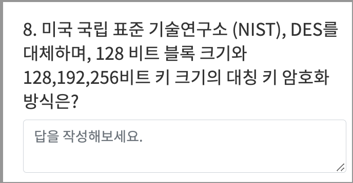

**- 소프트웨어 개발 보안 구축**

- sw 개발 3대 보안요소
  - **기무가** (기밀성, 무결성, 가용성)

- **DoS** (Denial of Service)
  - 시스템을 악의적으로 공격해 해당 시스템의 자원을 부족하게 해 사용하지 못하게 하는 공격
  - **SYN** - syn 패킷을 계속 보낸다. tcp 프로토콜의 구조적 문제점 이용
  - **UDP** - 대량의 udp 패킷을 만들어 임의 포트 번호로 전송
  - **스머프/스머핑** - 출발지 주소를 공격대상 ip로 설정, 네트워크 전체에 icmp echo 패킷을 직접 브로드캐스팅함.
  - **죽음의 핑** - icmp 패킷의 크기를 아주 크게 만들어 전송한다.
  - **랜드어택** - 출발지 ip와 목적지 ip를 같은 패킷 주소로 만들어 보낸다. 수신자가 자기자신에게 응답.
  - **티어드롭** - ip 패킷으이 재조합 과정에서 잘못된 fragment offset 정보로 인해 수신시스템이 문제를 발생하도록 만드는 방식
  - **봉크** - 같은 시퀀스 번호 계속 보냄
  - **보잉크** - 일정한 간격으로 시퀀스 번호에 빈공간 생성

- **DDoS** (Distributed DoS)
  - 여러 대의 공격자를 분산 배치해 동시 동작하게 함으로써 특정 사이트 공격
    - **Trinoo** - 많은 소스로부터 통합된 UDP flood 서비스 거부 공격을 유발하는데 사용
    - **TFN** - Trinoo와 비슷, 많은 소스에서 목표시스템에 대해 서비스 거부 공격
    - **Stacheldraht** - 분산 서비스 거부 에이전트 역할

- **DRDoS** (Distributed Reflection DoS)
  - 공격자는 출발지 IP 를 공격대상 IP로 위조하여 다수의 반사 서버로 요청 정보를 전송, 공격 대상자는 반사 서버로부터 다량의 응답을 받아서 서비스 거부 (DoS)가 되는 공격.

- **애플리케이션 공격**
  - DDoS 서비스 마비 공격
  - **HTTP GET 플러딩** - 과도한 get 메시지 이용 웹 서버의 과부하 유발
  - **Slowloris** -  (Slow HTTP header dos) 헤더의 최종 긑을 알리는 개행 문자열을 전송 X, 대상 웹 서버와 연결상태를 ㅈ아시간 지속
  - **RUDY** - (Skow HTTP POST DoS) content length 를 비정상적으로 크게 설정, 연결상태 유지
  - **Slow HTTP Read DoS** - tcp 운도 크기와 데이터 처리율을 감소 시킨 상태에서 다수 http를 전송, 대상 웹 서버의 연결상태가 장시간 지속, 연결자원 소진시키는 서비스 거부 공격
  - **Hulk DoS** - 공격자가 공격대상 웹 사이트 웹 페이지주소를 지속적으로 변경하며 다량으로부터 get 요청을 발생시킴.

- **네트워크 공격**
  - **스니핑**  - 공격대상에게 직접 공격 않고 데이터만 몰래 들여다보는 수동적 공격
  - **네트워크 스캐너** - 공격자가 hw, sw 구성 취약점을 탐색하는 공격 도구
  - **ip스푸핑** - 침입자가 인증된 컴 시스템인거처럼 속여 정보를 빼기 위해 본인의 패킷 헤더를 인증된 호스트의 ip 어드레스로 위조해 타깃에 전송
  - **ARP 스푸핑** - 공격자가 특정 호스트의 mac 주소를 자신의 mac 주소로 위조한 arp reply를 만들어 희생자에게 지속적 전송
  - **ICMP Redirection 공격** - 스니핑 시스템을 네트워크에 존재하는 또 다른 라우터라고 알림으로써 패킷의 흐름을 바꾸는 공격 기법
  - **트로이 목마** - 악성 루틴이 숨어있는 프롤그램.
  - **패스워드 크래킹**
    - 사전 공격
    - 무차별 대입
    - 패스워드 하이브리드 공격
    - 레인보우 테이블

- **버퍼 오버플로우 공격**
  - 메모리에 할당된 버퍼 크기를 초과하는 양의 데이터를 입력해 공격
    - 스택, 힙 오버플로우
  - **버퍼 오버플로우 공격 대응 방안**
    - **스택가드**  - 무결성 체크용 값을 복귀 주소, 변수 사이에 삽입. 버퍼 오버플로 발생시 카나리 값 체크.
    - **스택쉴드**  - 함수 시작 시 복귀 주소를 global ret란 특수 스택에 저장. 함수 종료 시 저장된 값과 스택 값을 비교해 다를 때 오버플로우로 간주
    - ASLR - 메모리 공격 방어 위해 주소 공간 배치를 난수화, 실행 마다 메모리 주소 변경, 버퍼 오버플로우 통한 특정 주소 호출 차단.
    - 안전한 함수 활용
    - 실행 제한

- **백도어**
  - 어떤 제품이나 컴퓨터 시스템, 암호 시스템 혹 알고리즘에서 정상적 인증 절차를 우회하는 기법

- **주요 시스템 보안 공격 기법**
  - 포맷 스트링 공격 - 외부로부터 입력된 값을 검증 없이 입출력 함수의 포맷 스트링을 그대로 사용하는 경우 발생하는 취약점 공격법
  - 레이스 컨디션 공격 - 둘 이상의 프로세스나 스레드가 공유 자원을 동시에 접근할 때 실행되는 프로세스가 임시파일을 만드는 경우 악의적인 프로그램을 통해 그 프로세스의 실행 중에 끼어들어 임시파일을 심볼릭 링크 함.
  - 키로거 공격 - 사용자의 움직임을 탐지해 저장해, 개인의 중요한 정보 빼감.
  - 루트킷 - 차후 침입을 위한 백도어, 트로이 목마 설치 등에 사용되는 프로그램 모음.

- **서버 접근 통제 유형**
  - MAC
  - DAC
  - RBAC
- **인증 기술 유형**
  - 지식 기반, 소지 기반, 생체 기반, 특징 기반

- **접근 통제 보호 모델** -  비무
  - 벨 라파듈라 모델 - 기밀성
  - 비바 모델    - 무결성

- **암호 알고리즘**
  - 양방향(암호화, 복호화)
    - 대칭키
      - DES, SEED, AES, ARIA, IDEA, LFSR
    - 비대칭키
      - 디피-헬만, RSA, ECC, EIGamal
  - 일방향(암호화)
    - 해시 암호 방식
      - MD5, SHA-1 SHA-256/384/512, HAS-160

---

- **대칭 키 암호화 알고리즘**
  - DES   - 미국 연방 표준국 발표
  - SEED  -  한국인터넷진흥원 개발
  - AES   - 미국 표준 기술 연구소, DES 상위 호환
  - ARIA  - 2004년 국가 정보원, 산학연구협회 개발
  - IDEA  - DES 대체를 위한 스위스 연방기술 기관
  - LFSR  - 선형 되먹임 시프트 레지스터, 선형함수로 계산

- **비대칭 키 암호화 알고리즘**
  - 디피-헬만 - 최초의 공개키 암호화, 이산 대수
  - RSA - 3명의 mit 수학 교수, 소인수 분해 알고리즘
  - ECC - RSA에서 대안, 타원 곡선 암호
  - ElGamal - 이산대수의 계산 문제 기본 원리

- **해시 암호화 알고리즘**
  - MD5 - MD4 개선
  - SHA-1 - 미국표준, DSA에서 사용, 해시 값 생성
  - SHA-356/384/512
  - HAS-160 - 국내 표준 서명 알고리즘 MD5+SHA-1 장점

---

- **IPSec** (Internet Protocol Security)
  - ip계층에서 무결성과 인증을 보장하는 인증 헤더와 기밀성을 보장하는 암호화를 이용한 ip 보안 프로토콜
  - 인증, 암호화, 키 관리 프로토콜로 구성
  
- **SSL/TLS**
  - 전송계층, 응용계층 사이에서 클라이언트와 서버 간 웹 데이터 암호화, 상호 인증 및 전송 시 데이터 무결성 보장 보안 프로토콜

- **S-HTTP**
  - 웹상에서 네트워크 트래픽을 암호화하는 주요방법, 클라이언트와 서버 간 전송되는 모든 메시지를 각각 암호화해 전송하는 기술

### 입력 데이터 검증 및 표현 취약점

- **XSS** : 검증되지 않은 외부 입력 데이터가 포함된 웹페이지를 사용자가 열람할 때 부적절한 스크립트가 실행되는 공격
- 사이트간 요청 위조 **(CSRF)** - 사용자가 자신의 의지와 무관하게 공격자가 의도한 행위를 특정 웹사이트에 요청하게 하는 공격
- SQL 삽입 : 악의적인 SQL 구문을 삽입하고 실행시켜 정보를 열람, 조작할 수 있는 취약점 공격법. 