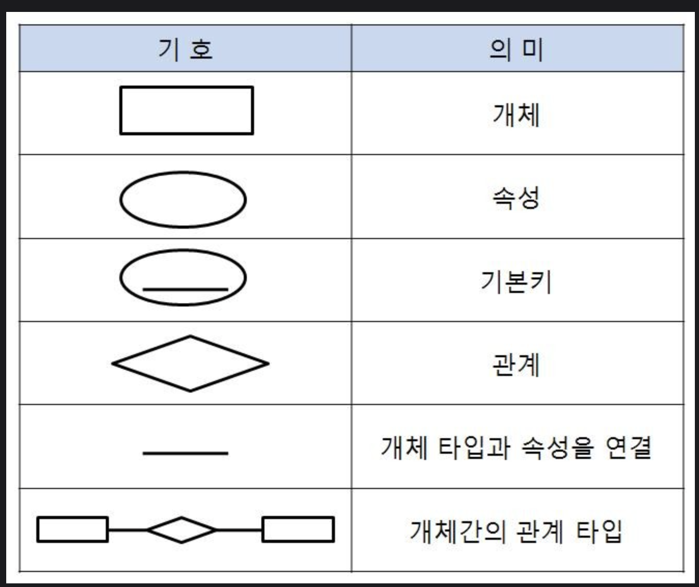

# 데이터 입출력 구현

---

## chap1. 논리 데이터 저장소 확인

- 데이터 모델
  - 현실 세계의 정보를 인간과 컴퓨터가 이해할 수 있도록 추상화 하여 표현한 모델
  - 데이터 모델 절차 (**개논물**)
    - **개념적** 데이터 모델
      - 현실 세계에 대한 인식을 추상,개념적으로 표현, 개념적 구조를 도출하는 데이터 모델.
      - **개체관계 다이어그램**이 주요 산출물
    - **논리적** 데이터 모델
      - 엄무의 모습을 모델링 표기법으로 형상화하여 사람이 이해하기 쉽게 표현한 데이터 모델
      - 논리적 데이터 모델링에서 **정규화**를 수행
      - 스키마의 평가 및 정재
    - **물리적** 데이터 모델
      - 논리 데이터 모델을 특정 DBMS 의 특성 및 성능을 고려하여 물리적인 스키마를 만드는 일련의 데이터 모델
      - 테이블,인덱스,뷰,파티션 등 객체 생성
      - 성능 측면 **반정규화** 수행
      - 저장 레코드 양식 설계
      - 접근 경로 설계
  - 논리 데이터 모델 검증
    - 업무의 모습을 모델링 표기법으로 형상화하여 사람이 이해하기 쉽게 표현하는 프로세스이다.
    - 논리적 데이터 모델링 종류  (**관계네**)
      - 관계 데이터 모델
        - 데이터를 행과 열로 구성된 2차원 테이블 형태로 구성한 모델
        - 구성요소 - **릴레이션, 튜플, 속성, 카디널리티, 차수, 스키마, 인스턴스**
        - 데이터 간 관계를 기본 키와 이를 참조하는 외래 키로 표현. 1:1, 1:N, M:N
        - 관계 대수 개념
          - 관계형 데이터베이스에서 원하는 정보와 그 정보를 어떻게 유도하는가를 기술하는 절차적 정형 언어.
          - 일반 집합 연산자 - 합집합, 교집합, 차집합, 카티션 프로덕트 (**합교차카**)
          - 순수 관계 연산자 (**셀프조디**)
            - 셀렉트 - 릴레이션 R에서 조건을 만족하는 튜플 반환
            - 프로젝트 - 릴레이션 R에서 주어진 속성들의 값으로만 구성된 튜플 반환
            - 조인 - 공통 속성을 이용해 R과 S의 튜플들을 연결해 만들어진 튜플 반환
            - 디비전 - 릴레이션 S의 모든 튜플과 관련 있는 R의 튜플 반환
            - ***이건 기호와 표현 법도 외우도록!***
        - 관계 해석
          - 튜플 관계 해석과 도메인 관계 해석을 하는 비절차적 언어
      - 계층 데이터 모델
      - 네트워크 데이터 모델
  - 논리 데이터 모델링 속성 (**개속관**)
    - **개체, 속성, 관계**로 구성
    - 개체
      - 사물 또는 사건으로 정의 됨.
    - 속성
      - 개체가 가지고 있는 요소 또는 성질
      - 속성명은 단수형으로 명명한다.
      - 개체명을 사용하지 않는다.
    - 관계
      - 두 개체 간의 관계
  - 개체-관계 (E-R) 모델
    - E-R 모델은 현실 세계에 존재하는 데이터와 그들 간의 관계를 사람이 이해할 수 있는 형태로 명확하게 표현하기 위해서 가장 널리 사용되고 있는 모델.

  
- **정규화**
  - 관계형 데이터 모델에서 데이터의 중복성을 제거하여 이상 현상을 방지하고, 데이터의 일관성과 정확성을 유지하기 위해 **무손실** 분해하는 과정
  - 이상현상(Anomaly)
    - 데이터의 중복성으로 인해 릴레이션을 조작할 때 발생하는 비합리적 현상
    - 삽입, 삭제, 갱신 이상이 있다.
    - 삽입 - 정보 저장 시 해당 정보의 불필요한 세부정보를 입력해야 하는 경우
    - 삭제 - 정보 삭제 시 원치 않는 다른 정보가 같이 삭제되는 경우
    - 갱신 - 중복 데이터 중 특정 부분만 수정되어 중복된 값이 모순을 일으키는 경우
  - 정규화 단계 (**원부이 결다조**)
    - 1정규형 (1NF)   - 원자값으로 구성
    - 2정규형 (2NF)   - 부분 함수 종속 제거(완전 함수적 종속 관계)
    - 3정규형 (3NF)   - 이행함수 종속 제거
    - 보이스-코드 정규형 (BCNF)   - 결정자 후보 키가 아닌 함수 종속 제거
    - 4정규형 (4NF)   - 다치(다중 값) 종속 제거
    - 5정규형 (5NF)   - 조인 종속 제거
    - **각 정규형이 어떤 일을 하는건지 이번에 확실하게 공부하기**
  - 반 정규화 (De-Normalization)
    - 정규화된 엔티티, 속성, 관계에 대해 성능 향상과 개발 운영의 단순화를 위해 중복, 통합, 분리 등을 수행하는 데이터 모델링의 기법
    - 반 정규화 특징
      - 장점 : 반 정규화된 데이터 구조는 성능 향상과 관리 효율성 증가
      - 단점 : 데이터의 일관성 및 정합성 저하   유지를 위한 비용이 별도로 발생해 성능에 나쁜 영향 미칠 수 있음.
    - 반 정규화 기법 (**테병분중 컬중 관중**)
      - 테이블
        - 테이블 병합
        - 테이블 분할
        - 중복 테이블 추가
      - 컬럼
        - 컬럼 중복화
      - 관계
        - 중복 관계 추가
      - 이 기법들도 다 알고 있자

---

## chap2. 물리 데이터 저장소 설계

- 물리 데이터 모델링 개념
  - 논리모델을 적용하고자 하는 기술에 맞도록 상세화해가는 과정
- 물리 데이터 모델링 변환 절차
  - 개체를 테이블로 변환
  - 속성을 컬럼으로 변환
  - UID를 기본키로 변환
  - 관계를 외래키로 변환
  - 컬럼 유형과 길이 정의
  - 반 정규화 수행
- 물리 데이터 저장소 구성
  - 테이블 제약조건 설계
    - 참조무결성 제약조건
      - **릴레이션과 릴레이션 사이에 대해 참조의 일관성을 보장하기 위한 조건.**
      - 두 개의 릴레이션이 기본키, 외래키를 통해 참조 관계를 형성할 경우, **참조하는 외래키의 값은 항상 참조되는 릴레이션에 기본키로 존재해야 한다.**
        - **제한**
          - 참조무결성 원칙을 위배하는 연산을 거절하는 옵션
        - **연쇄**
          - 참조되는 릴레이션에서 튜플을 삭제하고, 참조되는 릴레이션에서 이 튜플을 참조하는 튜플들도 함께 삭제하는 옵션
        - **널 값**
          - 참조되는 릴레이션에서 튜플을 삭제하고, 참조하는 릴레이션에서 해당 튜플을 참조하는 튜플들의 외래 키에 null 값을 넣는 옵션.
    - 인덱스 설계
      - 검색 연산의 최적화를 위해 데이터베이스 내 열에 대한 정보를 구성한 데이터 구조
      - 인덱스를 통해 전체 데이터의 검색 없이 필요한 정보에 대해 신속한 조회가 가능함.
      - 인덱스 적용 기준
        - 인덱스 **분포도** 가 10~15% 이내인 경우 아래 수식을 참고한다.
          - 분포도 = (1 / (컬럼 값의 종류)) X 100
          - 분포도 = (컬럼 값의 평균 ROW 수) / (테이블의 총 ROW 수) X 100
        - 인덱스 컬럼 설정 - 분포도가 좋은 컬럼은 단독적으로 생성한다.
        - 결합 인덱스는 구성되는 컬럼 순서 선정에 유의한다.
        - 설계 시 고려사항
          - 지나치게 많은 인덱스는 오버헤드로 작용함.
          - 인덱스는 추가적인 저장 공간이 필요함을 고려해야 한다.
          - 넓은 범위 인덱스 처리 시 오히려 전체 처리보다 많은 오버헤드 발생 가능
    - 뷰 설계
      - **RFNWW**
      - REPLACE - 뷰가 이미 존재하는 경우 재생성
      - FORCE - 본 테이블의 존재 여부에 관계없이 뷰 생성
      - NOFORCE - 기존 테이블이 존재할 때 뷰 생성
      - WITH CHECK OPTION - 서브 쿼리 내의 조건을 만족하는 행만 변경
      - WITH READ ONLY - 데이터 조작어 작업 불가
    - 클러스터 설계
      - 인덱스의 단점을 해결, 분포도가 넓을수록 오히려 유리
      - 액세스 기법이 아니라 액세스 효율 향상을 위한 물리적 저장 방법
      - 대량의 범위를 자주 액세스하는 경우 적용
      - 여러 개의 테이블이 빈번하게 조인을 일으킬때 활용
      - UNION, DISTINCT, ORDER BY, GROUP BY 많이 하는 컬럼이면 검토대상
      - 수정을 많이 안하는 컬럼 검토대상
    - 파티션 설계
      - 파티션 종류 (**레해리컴**)
        - 레인지 파티셔닝
          - 연속적인 숫자나 날짜를 기준으로 하는 파티셔닝기법
          - 관리 시간의 단축 가능
        - 해시 파티셔닝
          - 파티션 키의 해시 함수 값에 의한 파티셔닝 기법
            - 균등한 데이터 분할이 가능하고 질의 성능이 향상 가능
        - 리스트 파티셔닝
          - 특정 파티션에 저장 될 데이터에 대한 명시적 제어가 가능한 파티셔닝 기법
          - 분포도가 비슷하고 데이터가 많은 SQL에서 컬럼의 조건이 많이 들어오는 경우 유용
        - 컴포지트 파티셔닝
          - 레인지,해시,리스트 파티셔닝 중 2개 이상의 파티셔닝을 결합하는 파티셔닝 기법
          - 큰 파티션에 대한 I/O 요청을 여러 파티션으로 분산할 수 있다.
      - 파티션 장점 (**성가백경**)
        - 성능향상 - 데이터 액세스 범위를 줄여 성능 향상
        - 가용성 향상 - 전체 데이터의 훼손 가능성 감소, 데이터 가용성 향상
        - 백업 가능 - 분할 영역을 독립적으로 백업, 복구 가능
        - 경합 감소  - 디스크 스트라이핑으로 입출력 성능 향
    - 디스크 구성 설계
      - 정확한 용량 산정, 디스크 사용의 효율 높임.
      - 업무량이 집중되어 있는 디스크를 분리하여 설계
      - 입출력 경합을 최소화해 데이터의 접근 성능을 향상 시킴.
      - 디스크 구성에 따라 테이블스페이스 개수와 사이즈 등 결정
      - 파티션 수행 테이블 별도 분류
  
---

## chap3. 데이터베이스 기초 활용하기

- 데이터베이스 종류
  - 데이터 베이스
    - 다수의 인원, 시스템, 프로그램이 사용할 목적으로 통합해 관리되는 데이터 집합.
    - 효과적 관리를 위해 중복성 제거, 무결성 확보, 일관성 유지, 유용성 보장 등 중요
    - 데이터 베이스 정의 (**통저운공**)
      - 통합된 데이터 - 자료의 중복을 배제한 데이터 모임
      - 저장된 데이터 - 저장 매체에 저장된 데이터
      - 운영 데이터 - 조직의 업무를 수행하는 데 필요한 데이터
      - 공용 데이터 - 여러 애플리케이션, 시스템들이 공동으로 사용하는 데이터
    - 데이터베이스 특성 (**실계동내**)
      - 실시간 접근성
      - 계속적인 변화
      - 동시공용
      - 내용 참조
    - 데이터베이스 종류
      - 파일시스템 개념
        - 파일에 이름을 부여하고 저장이나 검색을 위하여 논리적으로 그것을 어디에 위치시켜야 하는지 정의한 뒤 관리하는 데이터베이스 전 단계의 데이터 관리 방식
        - ISAM
        - VSAM
      - 관계형 데이터베이스 관리 시스템
        - 관계형 모델을 기반으로 하는 가장 보편화된 데이터베이스 관리 시스템
        - 데이터를 저장하는 테이블의 일부를 다른 테이블과 상하 관계로 표시하며 상관관계를 정리함.
        - Oracle, SQL server, MySQL, Maria DB 등
      - 계층형 데이터베이스 관리 시스템
        - 계층형 DBMS는 데이터를 상하 종속적인 관계로 계층화하여 관리하는 데이터베이스
        - 접근속도가 빠르지만, 종속적인 구조로 인하여 변화하는 데이터 구조에 유연하게 대응하기 쉽지 않다.
      - 네트워크 데이터베이스 관리 시스템
        - 네트워크 DBMS 는 데이터의 구조를 네트워크상의 망상 형태로 표현한 데이터 모델.
        - 트리 구조나 계층형 데이터베이스보단 유연하지만 설계가 복잡한 단점 존재
    - 데이터베이스 관리 툴
      - 데이터베이스 생성, 삭제
      - SQL 명령어 작성 및 실행
      - 상태 모니터링
      - 사용자 계정 관리
      - 데이터베이스 내보내기 / 가져오기
      - 환경 설정
  - DBMS
    - 데이터 관리의 복잡성을 해결하는 동시에 데이터 추가, 변경, 검색, 삭제 및 백업, 복구, 보안 등의 기능을 지원하는 소프트웨어.
    - 유형 (**키컬도그**)
      - 키-값 DBMS
        - 키 기반 get, put, delete 제공, 메모리 기반 성능 우선 시스템 및 빅데이터 처리 가능 DBMS
        - Unique 한 키에 하나의 값을 가진 형태
      - 컬럼기반 데이터 저장 DBMS
        - key 안에 (column, value) 조합으로 된 여러 필드를 갖는 dbms.
        - 테이블 기반, 조인 미지원, 컬럼 기반으로 구글의 빅테이블 기반으로 구현
      - 문서 저장 DBMS
        - 값의 데이터 타입이 문서라는 타입을 사용하는 DBMS.
        - 문서 타입은 XML, JSON 과 같이 구조화된 데이터 타입으로, 복잡한 계층 구조 표현 가능.
      - 그래프 DBMS
        - 시맨틱 웹과 온톨로지 분야에서 활용되는 그래프로 데이터를 표현하는 DBMS
        - 노드와 엣지로 특징되는 요소 특화
        - 노드 간 관계를 구조화하여 저장.
    - DBMS 특징 (**무일회보효**)
      - 데이터 무결성 
        - 부적절한 자료가 입력돼 동일한 내용에 대해 서로 다른 데이터가 저장되는 것을 허용하지 않는 성질
      - 데이터 일관성
        - 삽입,삭제,갱신, 생성 후에도 저장된 데이터가 변함없이 일정
      - 데이터 회복성
        - 장애가 발생했을 시 특정 상태로 복구되어야하는 성질
      - 데이터 보안성
        - 불법적인 노출, 변경, 손실로부터 보호되어야하는 성질
      - 데이터 효율성
        - 응답 시간, 저장 공간 활용 등이 최적화 되어 사용자, 소프트웨어, 시스템 등 요구 조건을 만족시켜야 하는 성질
      - 이거 각 성질 명 설명 알자!   
    - 상용 DBMS 및 오픈 소스 기반 DBMS
      - 상용 DBMS - 특정 회사에서 유료로 판매하는 시스템. 
        - 유지보수, 지원 원활
      - 오픈 소스 기반 DBMS
        - 오픈 소스 라이선스 정책을 준용하는 범위 내에서 사용이 자유로움.
  - 데이터베이스 기술 트랜드
    - 빅데이터 
      - 시스템, 서비스, 조직 등에서 주어진 비용, 시간 내에 처리 가능한 데이터 범위를 넘어서는 수십 페타바이트 크기의 비정형 데이터.
      - 데이터의 양(Volume)
      - 데이터의 다양성(Variety)
      - 데이터의 속도(Velocity)
      - 빅데이터 수집, 저장, 처리 기술
        - 비정형/반정형 데이터 수집
        - 정형 데이터 수집
        - 분산데이터 저장/처리
        - 분산데이터 베이스
